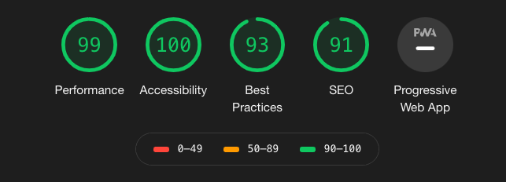

# Basic NodeJs React App

This is a basic application used for starting fullstack NodeJs applications. 

Stack built using React, Express and Webpack. 

The app currently displays the top ten stories on https://news.ycombinator.com/ (aka Hacker News) to give an example of rendering dynamic content. 


## Requirements
 - Node JS: v12.16.x
 - NPM: 6.14.x


## Installation
From the root directory where the package.json file is located run the following command to install project dependencies. 

```bash
npm install
```

## Running The App
Running the following command will bundle the client side code into static files using webpack. This is then served by Express from the ```dist``` folder.

```bash
npm run start
```

## Performance
The app currently receives 90+ scores when auditted using Google Lighthouse
